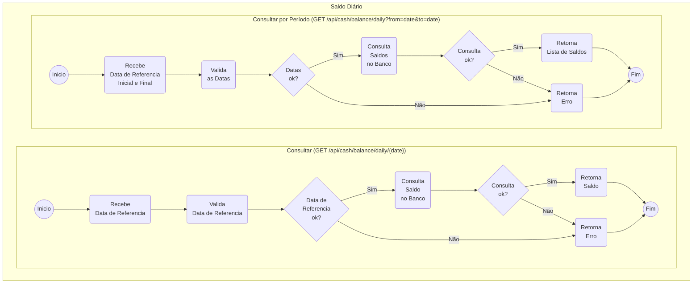

```mermaid
graph 
    subgraph Saldo Diário
        subgraph "Consultar (GET /api/cash/balance/daily/{date})"
            direction LR
            A1((Inicio)) --> B1(Recebe \nData de Referencia)
            B1 --> C1(Valida \nData de Referencia)
            C1 --> D1{Data de \nReferencia\n ok?}
            D1 --> |Sim| E1(Consulta \nSaldo\n no Banco)
            E1 --> F1{Consulta\n ok?}
            F1 -->|Sim| G1(Retorna \nSaldo)
            D1 -->|Não| Y1(Retorna\n Erro)
            F1 -->|Não| Y1
            G1 --> Z1
            Y1 --> Z1((Fim))
        end
        subgraph "Consultar por Período (GET /api/cash/balance/daily?from=date&to=date)"
            direction LR
            A2((Inicio)) --> B2(Recebe \nData de Referencia\n Inicial e Final)
            B2 --> C2(Valida \nas Datas)
            C2 --> D2{Datas\n ok?}
            D2 --> |Sim| E2(Consulta \nSaldos\n no Banco)
            E2 --> F2{Consulta\n ok?}
            F2 -->|Sim| G2(Retorna \nLista de Saldos)
            D2 -->|Não| Y2(Retorna\n Erro)
            F2 -->|Não| Y2
            G2 --> Z2
            Y2 --> Z2((Fim))
        end
    end
```