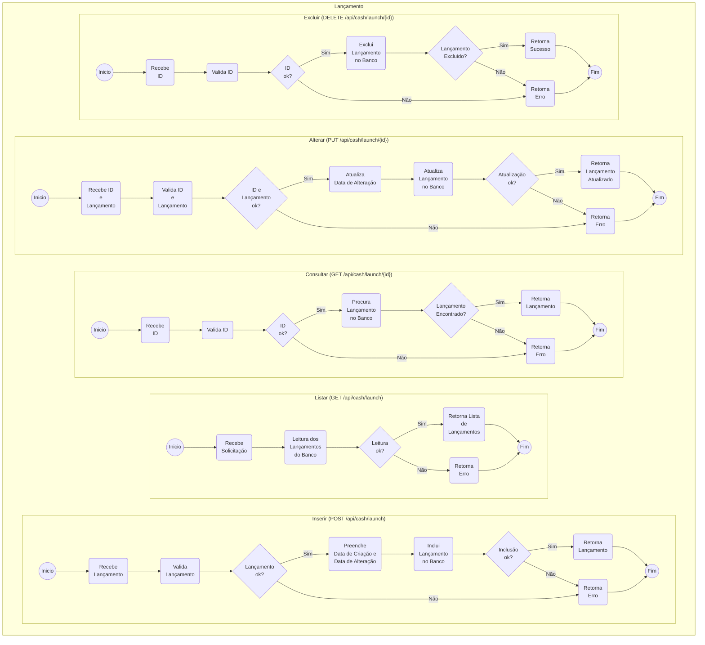

```mermaid
graph 
    subgraph Lançamento
        subgraph "Inserir (POST /api/cash/launch)"
            direction LR 
            A1((Inicio)) --> B1(Recebe \nLançamento)
            B1 --> C1(Valida \nLançamento) 
            C1 --> D1{Lançamento\n ok?}
            D1 -->|Sim| E1(Preenche \n Data de Criação e \n Data de Alteração)
            E1 --> F1(Inclui \n Lançamento\n no Banco)
            F1 --> G1{Inclusão\n ok?}
            G1 -->|Sim| X1(Retorna\n Lançamento)
            D1 -->|Não| Y1(Retorna \nErro)
            G1 -->|Não| Y1
            X1 --> Z1
            Y1 --> Z1((Fim))
        end
        subgraph "Listar (GET /api/cash/launch)"
            direction LR 
            A2((Inicio)) --> B2(Recebe \nSolicitação)
            B2 --> C2(Leitura dos \nLançamentos\n do Banco)
            C2 --> D2{Leitura\n ok?}
            D2 -->|Sim| E2(Retorna Lista\n de \nLançamentos)
            D2 -->|Não| Y2(Retorna\nErro)
            E2 --> Z2
            Y2 --> Z2((Fim))
        end
        subgraph "Consultar (GET /api/cash/launch/{id})"
            direction LR
            A3((Inicio)) --> B3(Recebe\n ID)
            B3 --> C3(Valida ID)
            C3 --> D3{ID\nok?}
            D3 --> |Sim| E3(Procura \nLançamento\n no Banco)
            E3 --> F3{Lançamento\n Encontrado?}
            F3 -->|Sim| G3(Retorna \nLançamento)
            D3 -->|Não| Y3(Retorna\n Erro)
            F3 -->|Não| Y3
            G3 --> Z3
            Y3 --> Z3((Fim))
        end
        subgraph "Alterar (PUT /api/cash/launch/{id})"
               direction LR 
            A4((Inicio)) --> B4(Recebe ID \ne\n Lançamento)
            B4 --> C4(Valida ID \n e \nLançamento) 
            C4 --> D4{ID e \nLançamento\n ok?}
            D4 -->|Sim| E4(Atualiza \nData de Alteração)
            E4 --> F4(Atualiza \nLançamento\n no Banco)
            F4 --> G4{Atualização\n ok?}
            G4 -->|Sim| X4(Retorna \nLançamento\n Atualizado)
            D4 -->|Não| Y4(Retorna \n Erro)
            G4 -->|Não| Y4
            X4 --> Z4
            Y4 --> Z4((Fim))     
        end
        subgraph "Excluir (DELETE /api/cash/launch/{id})"
            direction LR
            A5((Inicio)) --> B5(Recebe\n ID)
            B5 --> C5(Valida ID)
            C5 --> D5{ID\nok?}
            D5 --> |Sim| E5(Exclui \nLançamento\n no Banco)
            E5 --> F5{Lançamento\n Excluido?}
            F5 -->|Sim| G5(Retorna\n Sucesso)
            D5 -->|Não| Y5(Retorna\n Erro)
            F5 -->|Não| Y5
            G5 --> Z5
            Y5 --> Z5((Fim))
        end
    end
```